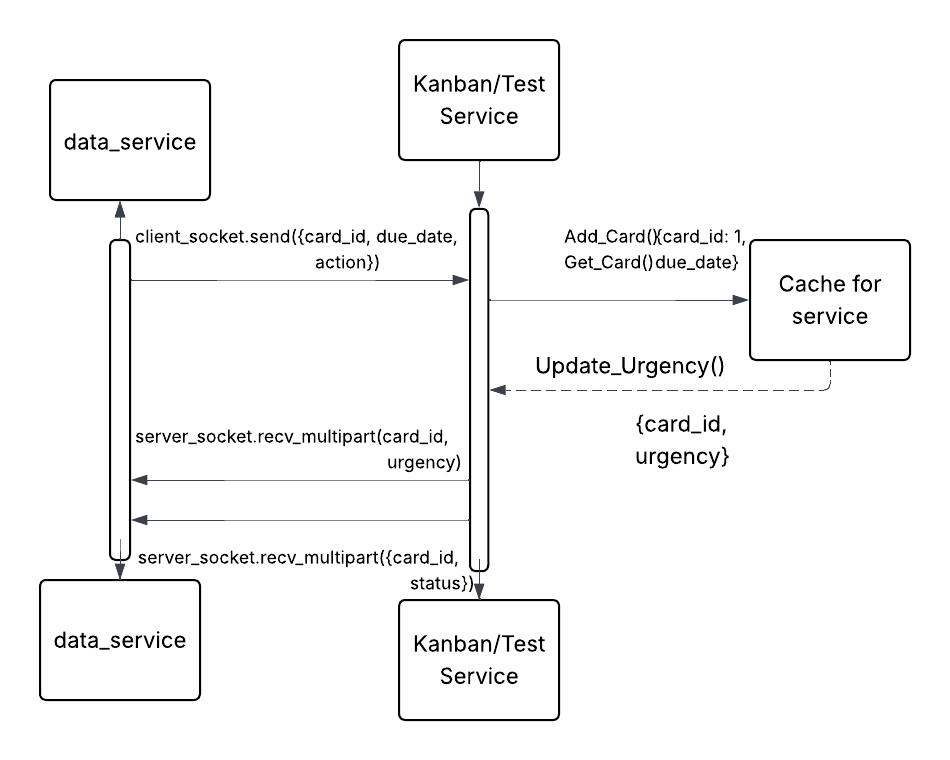

# Date Urgency Microservice
Grace Kohler

# Context 
This was part of a microservices project that I did as part of my university course for software development for another person's application
## Introduction
The date_service.py microservice and the test_server is a basic implementation of the Microservice for the Kanban board that will assign urgency to dates. 

## Usage Instructions
### Setup
Clone the repository to your local machine--as files must be run locally. 
`git clone https://github.com/gkohler159/Jesus_Microservice_Final.git`

### The Data Service
python data_service.py: 
This program auto runs on its own. Logging is included for any troubleshooting. This is the automated service
`python data_service.py`

### The Test Server
python test_server.py
`python test_server.py`
This program helps to test the data_service.py as a separate server. The user will need to follow the prompts as follows:
card_id: Any given id 
date: Must be in the format of "2025-08-04T15:55:00"
options (1 or 2): 1 will add a new card, 2 will obtain the due date

## Function Calls
### Recieving From 
It should be noted that this is using ZMQ Dealer/Router methods which requires a slightly different approach than a traditional REQ/REP response. 
This is to accomodate for the async nature of this program. A function call to recieve can be made like so:
```
message_contents = server_socket.recv_multipart()
identity, content = message_contents[0], message_contents[-1]
message = zmq.utils.jsonapi.loads(content.decode('utf-8'))
```
The format to expect a reciept of an urgency status is as follows:
```
{
'card_id' = card_id,
'urgency' = urgency_level
}
```
### Sending To
In order to send to the program, with the dealer approach, you will need to have a Dealer socket that will attach an ID. This is a simple process.
It should be noted that like recieving from, this will require UTF-8.
```
reply = json.dumps(package).encode('utf-8')
client_socket.send(reply)
print(f"reply: {reply}")
```
The format that the reply must be sent in is as follows in this example:
```
{
'card_id': card_id,
'due_date': 2025-08-03T15:55:00
'action': 1
}
```

## UML Diagram



